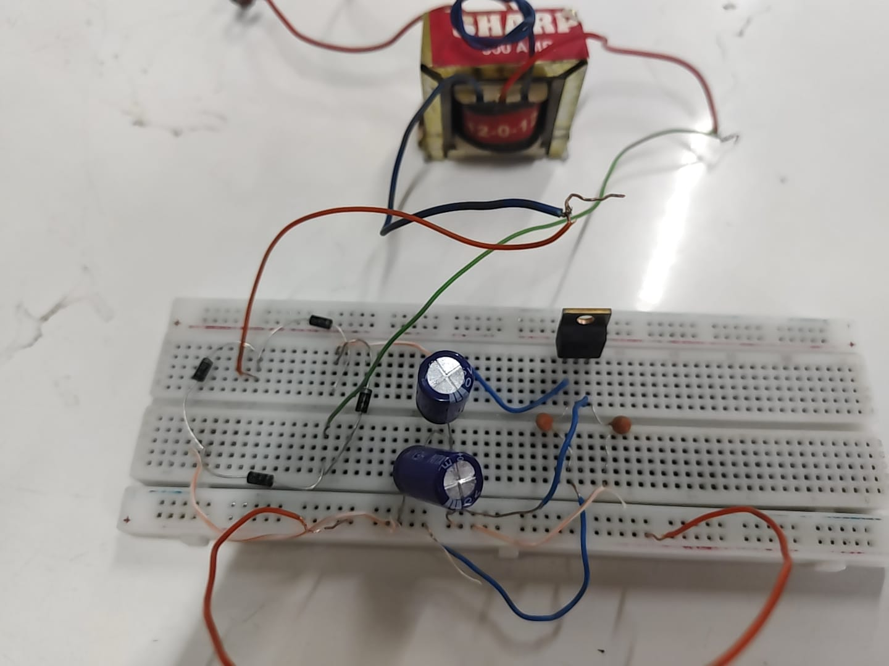
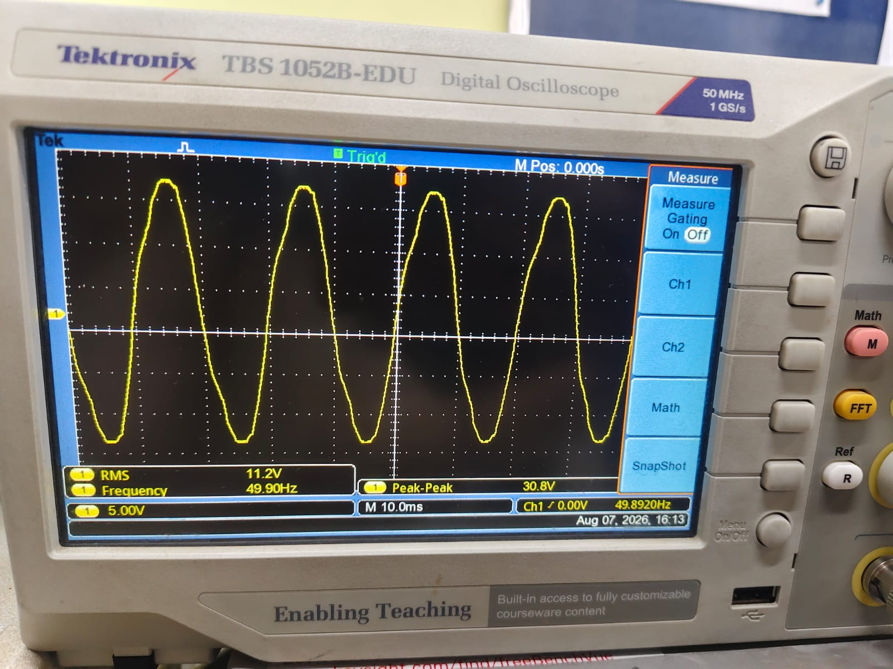
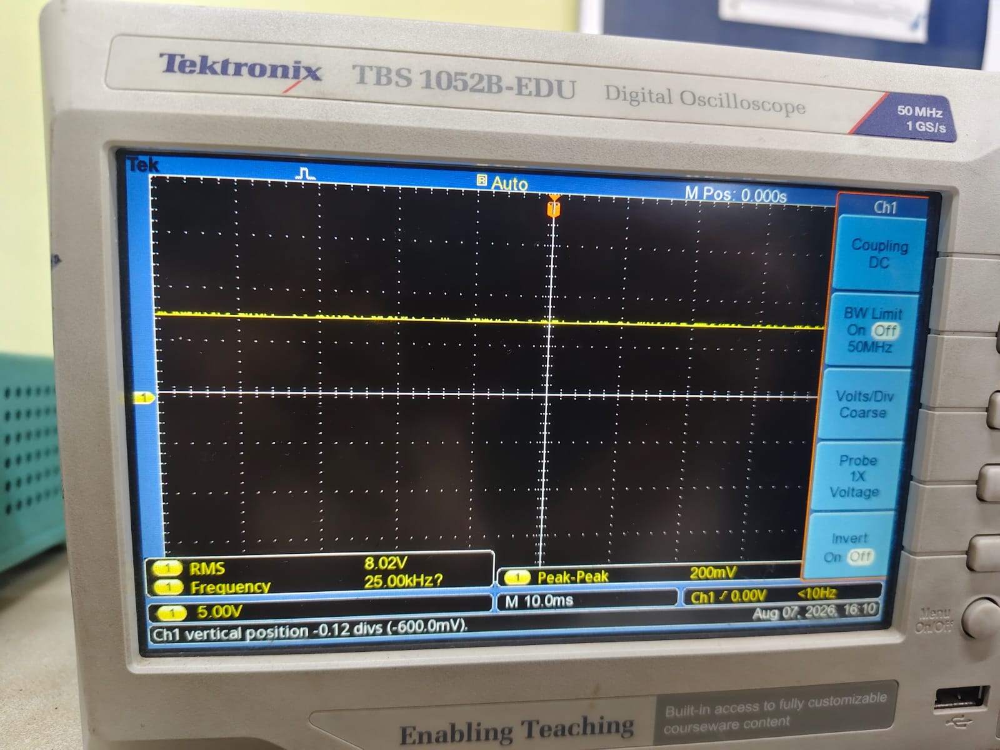

# Regulated DC Power Supply

A hardware-based regulated DC power supply designed and tested using a step-down transformer, rectifier, filter capacitors, and a voltage regulator.

## Project Overview

The objective of this project is to convert AC voltage into a stable regulated DC output.

### Block Flow

AC Input → Step-Down Transformer → Rectifier → Filter → Voltage Regulator → Regulated DC Output

## Components Used

- 12-0-12 Step-down Transformer
- 1N4007 Rectifier Diodes
- 1000 µF Filter Capacitors
- IC 7808 Voltage Regulator
- Breadboard
- Digital Storage Oscilloscope (DSO/CRO)

## Working Principle

1. The step-down transformer reduces the AC voltage.
2. The rectifier converts the AC voltage into pulsating DC.
3. Filter capacitors reduce the ripple in the rectified output.
4. The voltage regulator provides a stable DC output.
5. The input and output waveforms are observed using a Digital Storage Oscilloscope.

## Hardware Implementation

The circuit was assembled and tested on a breadboard using the components listed above.

## Experimental Results

### AC Input Waveform

The AC waveform was observed on the Digital Storage Oscilloscope at approximately 50 Hz.

### Regulated DC Output

A stable regulated DC output of approximately 8 V was observed on the oscilloscope.

## Observations

- AC was successfully rectified.
- Ripple was reduced using filter capacitors.
- A stable regulated DC output was obtained.

## Result

The regulated DC power supply was successfully designed and tested. The oscilloscope confirmed the AC input and stable regulated DC output.

## Conclusion

The circuit worked as expected and provided a stable DC supply suitable for low-voltage electronic applications.

## Project Report

[View the complete project report](dc%20power%20supply%20.pdf)

## Team

- Kashish Thakur
- Sosan Zehra
- Sonam Kumari
